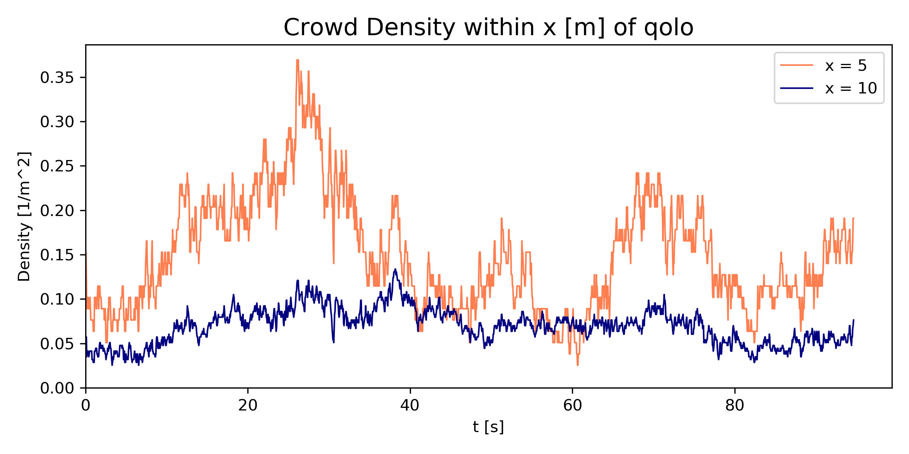
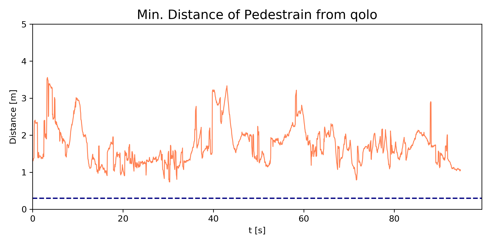
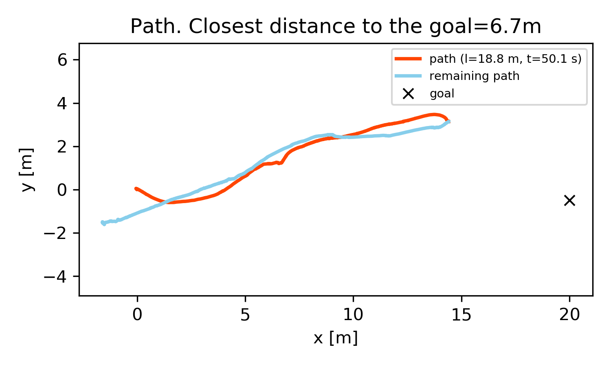
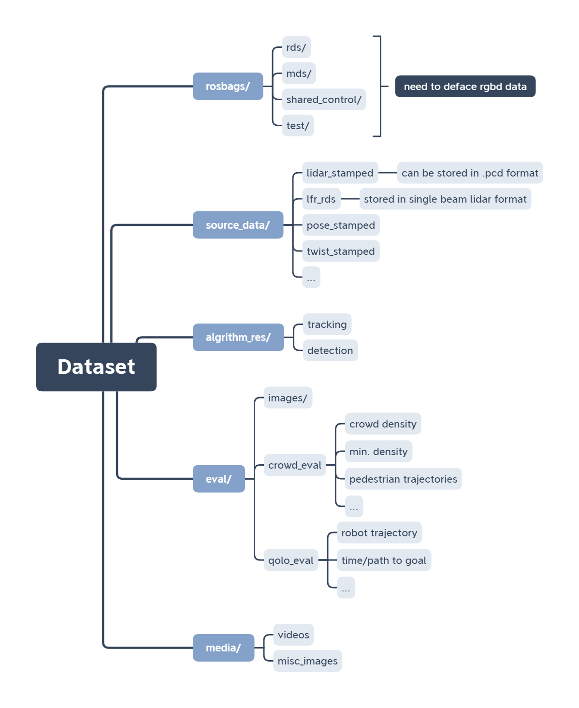

# crowdbot-evaluation-tools

> Repository for crowd tracking and robot performance evaluation in experiments

## File & Folder

- [`docs/`](./docs/): documentation
- [`qolo/`](./qolo/): codespace for crowdbot evaluation
- [`notebook/`](./notebook/): example notebooks for demo
  - **[intro_to_dataset.ipynb](https://github.com/epfl-lasa/crowdbot-evaluation-tools/blob/main/notebooks/intro_to_dataset.ipynb)**
  - **[comprehensive_eval.ipynb](https://github.com/epfl-lasa/crowdbot-evaluation-tools/blob/main/notebooks/comprehensive_eval.ipynb)**
- [`crowdbot_tools_archive/`](./crowdbot_tools_archive/): archive of https://github.com/danjia21/crowdbot_tools
- `dev_log.md`: update development once updated!

## Examples

    
<b>animation with qolo trajectories and detection/tracking results within 8 meter</b>
 
  

    
<b>eval_crowd demo</b>

    

        
<b>crowd_density variations along the timestamps</b>
 
  

    

    

        
<b>min_dist variations along the timestamps</b>
 
  

    

    
<b>eval_qolo demo</b>

    

        
<b>path/time to goal</b>
 
  

    

    

        
<b>twist_acc_jerk</b>
 
  

    

## Dataset

    
<b>Proposed dataset structure</b>
 
  

## Acknowledgment

- https://github.com/epfl-lasa/qolo-evaluation
