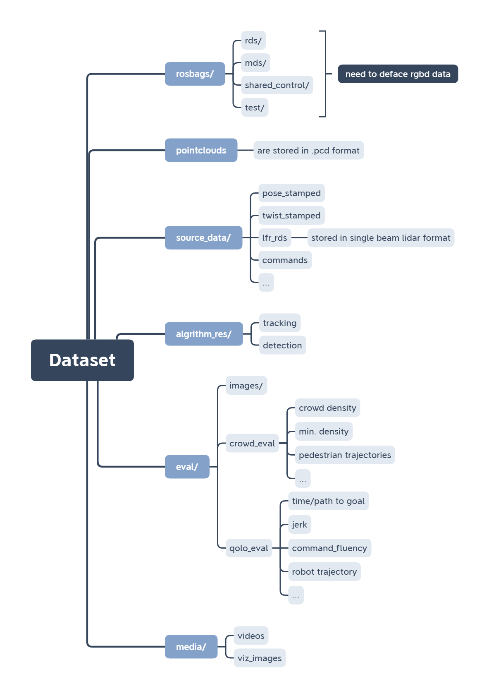
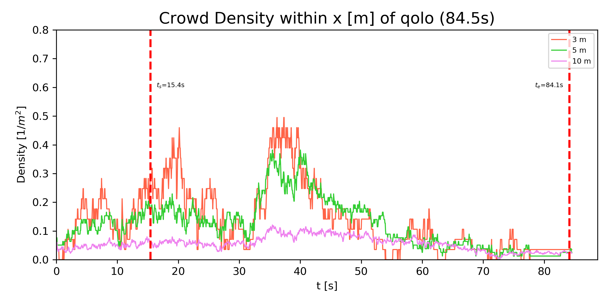
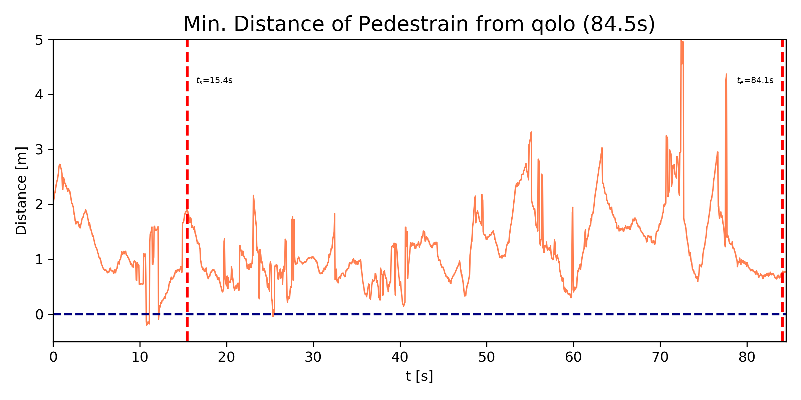
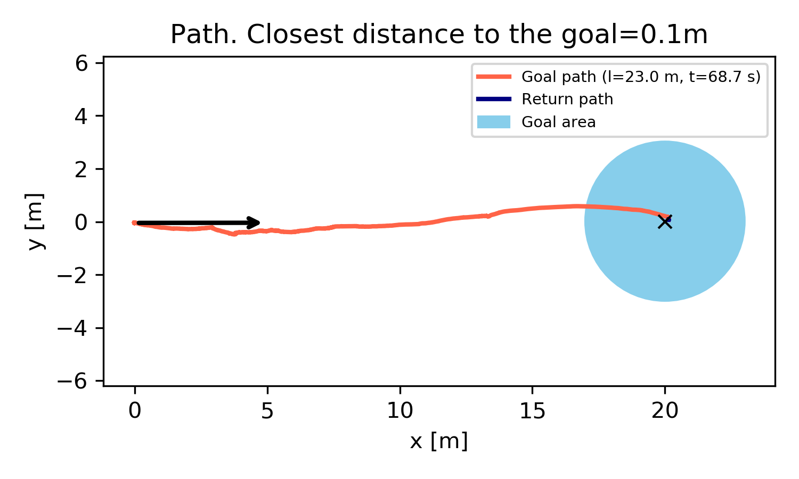
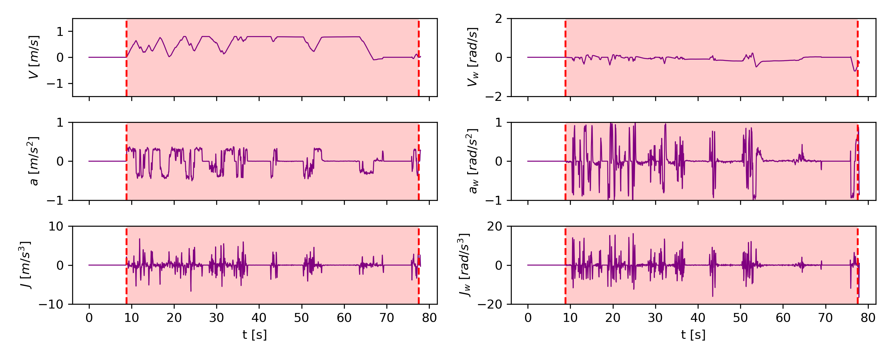
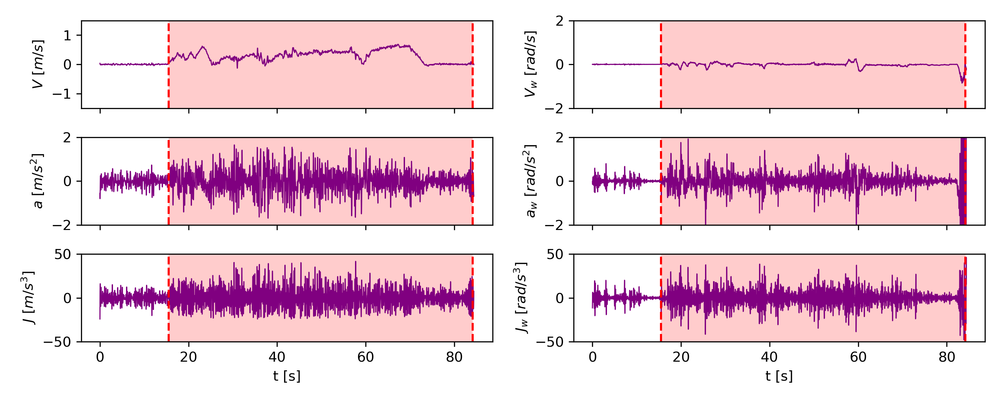

# crowdbot-evaluation-tools

</>

> Repository for crowd tracking and robot performance evaluation in navigation experiments

## Files & Folders

- [`docs/`](./docs/): documentation
- [`qolo/`](./qolo/): codespace for crowdbot evaluation
- [`notebook/`](./notebook/): example notebooks for demo
  - **[intro to dataset](https://github.com/epfl-lasa/crowdbot-evaluation-tools/blob/main/notebooks/intro_to_dataset.ipynb)**
  - **[comprehensive evaluation](https://github.com/epfl-lasa/crowdbot-evaluation-tools/blob/main/notebooks/comprehensive_eval_ver3.ipynb)**
- [`sh_scripts/`](./sh_scripts/): shell scripts to execute pipelines for extracting source data, applying algorithms, and evaluating with different metrics
- [`crowdbot_tools_archive/`](./crowdbot_tools_archive/): archive of https://github.com/danjia21/crowdbot_tools

## Dataset

### Structure

    
<b>Proposed dataset structure</b>
 
  

### Demo

| **Example**                                                  | **Visualization**                                            |
| ------------------------------------------------------------ | ------------------------------------------------------------ |
| **Qolo trajectories with tracked bounding box** (generated using [`gen_viz_img.py`](https://github.com/epfl-lasa/crowdbot-evaluation-tools/blob/main/qolo/gen_viz_img.py) and [`gen_animation.py`](https://github.com/epfl-lasa/crowdbot-evaluation-tools/blob/main/qolo/gen_animation.py)) |  |
| **Crowd density** (generated using [`eval_crowd.py`](https://github.com/epfl-lasa/crowdbot-evaluation-tools/blob/main/qolo/eval_crowd.py)) |  |
| **Minimal distance** of pedestrian to Qolo (generated using [`eval_crowd.py`](https://github.com/epfl-lasa/crowdbot-evaluation-tools/blob/main/qolo/eval_crowd.py)) |  |
| **Path efficiency** (generated using [`eval_qolo_path.py`](https://github.com/epfl-lasa/crowdbot-evaluation-tools/blob/main/qolo/eval_qolo_path.py)) |  |
| **Qolo command** (generated using [`eval_qolo_ctrl.py`](https://github.com/epfl-lasa/crowdbot-evaluation-tools/blob/main/qolo/eval_qolo_ctrl.py)) |  |
| **Qolo state** (generated using [`eval_qolo_ctrl.py`](https://github.com/epfl-lasa/crowdbot-evaluation-tools/blob/main/qolo/eval_qolo_ctrl.py)) |  |

## References:

_Crowd navigation DATASET:_

Paez-Granados D., Hen Y., Gonon D., Huber L., & Billard A., (2021), “Close-proximity pedestrians’ detection and tracking from 3D point cloud and RGBD data in crowd navigation of a mobile service robot.”, Dec. 15, 2021. IEEE Dataport, doi: https://dx.doi.org/10.21227/ak77-d722.

_Qolo Robot:_

> [1] Paez-Granados, D., Hassan, M., Chen, Y., Kadone, H., & Suzuki, K. (2022). Personal Mobility with Synchronous Trunk-Knee Passive Exoskeleton: Optimizing Human-Robot Energy Transfer. IEEE/ASME Transactions on Mechatronics, 1(1), 1–12. https://doi.org/10.1109/TMECH.2021.3135453

> [2] Paez-Granados, D. F., Kadone, H., & Suzuki, K. (2018). Unpowered Lower-Body Exoskeleton with Torso Lifting Mechanism for Supporting Sit-to-Stand Transitions. IEEE International Conference on Intelligent Robots and Systems, 2755–2761. https://doi.org/10.1109/IROS.2018.8594199

_Reactive Navigation Controllers:_

> [3] Gonon, D. J., Paez-Granados, D., & Billard, A. (2021). Reactive Navigation in Crowds for Non-holonomic Robots with Convex Bounding Shape. IEEE Robotics and Automation Letters, 6(3), 4728–4735. https://doi.org/10.1109/LRA.2021.3068660

> [4] Huber, L., Billard, A., & Slotine, J.-J. (2019). Avoidance of Convex and Concave Obstacles With Convergence Ensured Through Contraction. IEEE Robotics and Automation Letters, 4(2), 1462–1469. https://doi.org/10.1109/lra.2019.2893676

> [5] Paez-Granados, D., Gupta, V., & Billard, A. (2021). Unfreezing Social Navigation : Dynamical Systems based Compliance for Contact Control in Robot Navigation. Robotics Science and Systems (RSS) - Workshop on Social Robot Navigation, 1(1), 1–4.http://infoscience.epfl.ch/record/287442?&ln=en.  https://youtu.be/y7D-YeJ0mmg

_Qolo shared control:_

> [6] Chen, Y., Paez-Granados, D., Kadone, H., & Suzuki, K. (2020). Control Interface for Hands-free Navigation of Standing Mobility Vehicles based on Upper-Body Natural Movements. IEEE/RSJ International Conference on Intelligent Robots and Systems (IROS-2020). https://doi.org/10.1109/IROS45743.2020.9340875

## Acknowledgment

We thank Prof. Kenji Suzuki from AI-Lab, University of Tsukuba, Japan for lending the robot Qolo used in these experiments and data collection.

This project was partially founded by:

The EU Horizon 2020 Project CROWDBOT (Grant No. 779942): http://crowdbot.eu
