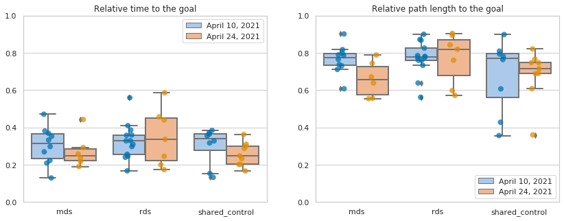
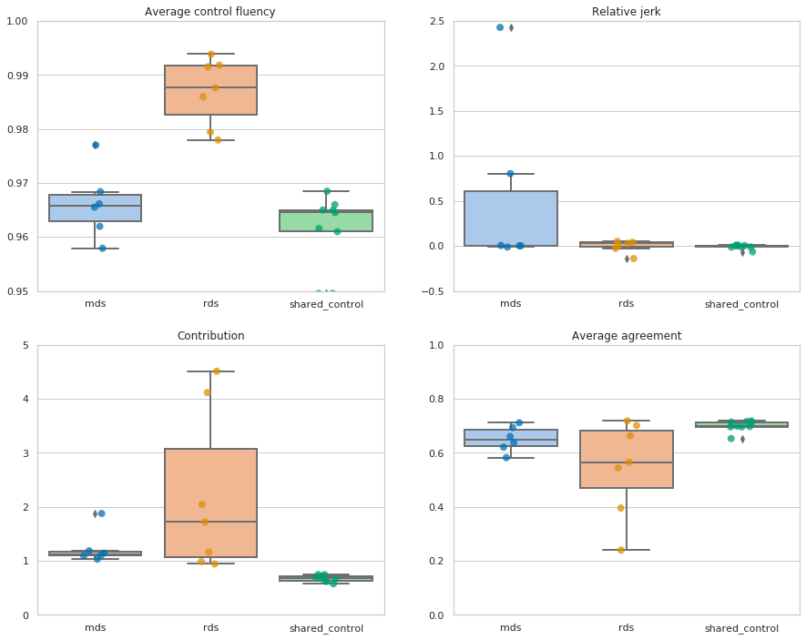
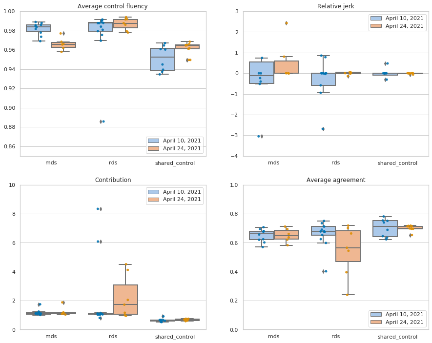
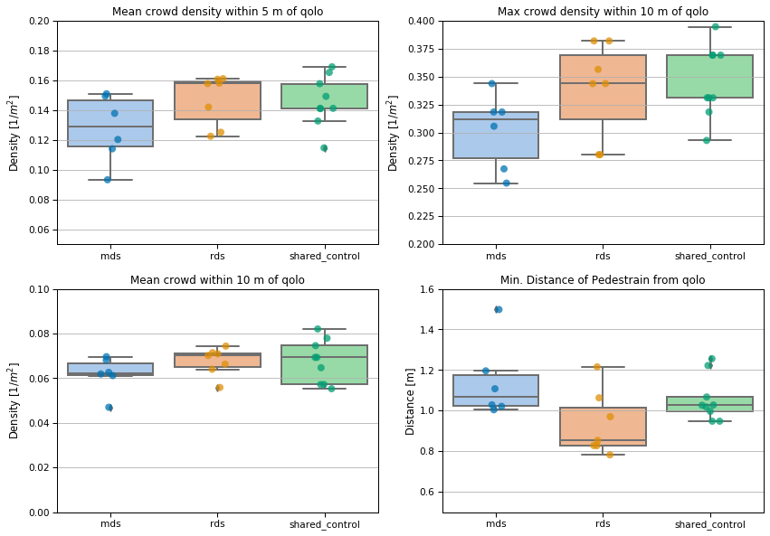
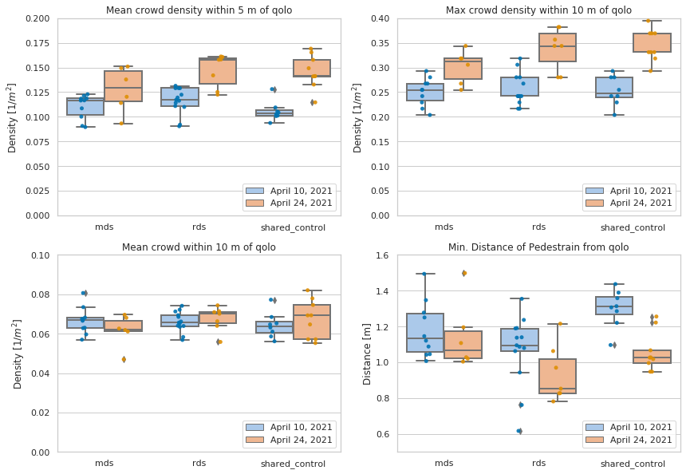
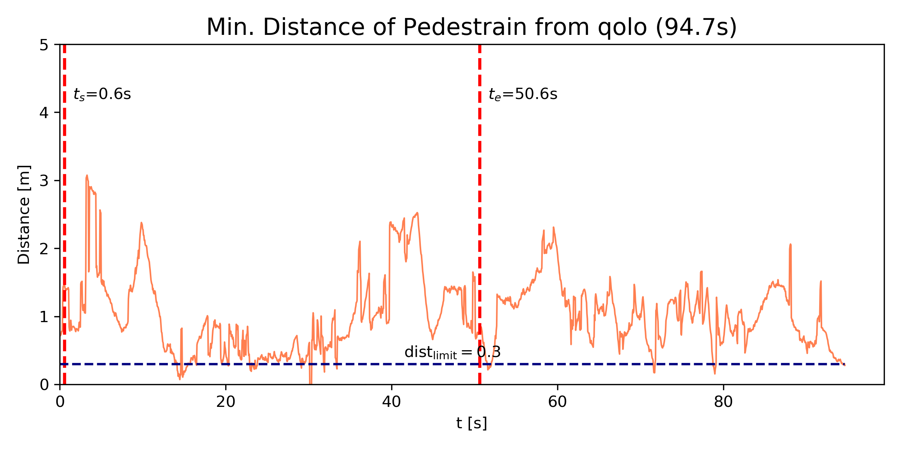

# notebooks/

## Main

- **[intro_to_dataset.ipynb](https://github.com/epfl-lasa/crowdbot-evaluation-tools/blob/main/notebooks/intro_to_dataset.ipynb)**
- **[comprehensive_eval.ipynb](https://github.com/epfl-lasa/crowdbot-evaluation-tools/blob/main/notebooks/comprehensive_eval.ipynb)**

## Example results

### Path efficiency-related metrics

- **Overall** analysis on 0424

  

- **Comparison** analysis between 0424 and 0410

  

- **Single** 0424_shared_control/2021-04-24-13-07-54 sequence

    

### Shared control-related metrics

- **Overall** analysis on 0424

  

- **Comparison** analysis between 0424 and 0410

    

- **Single** 0424_shared_control/2021-04-24-13-07-54 sequence

    

### Crowd-related metrics

- **Overall** analysis on 0424

  

- **Comparison** analysis between 0424 and 0410

  

- **Single** 0424_shared_control/2021-04-24-13-07-54 sequence

  | crowd_density                                                | min_dist                                                     |
  | ------------------------------------------------------------ | ------------------------------------------------------------ |
  |  |  |

